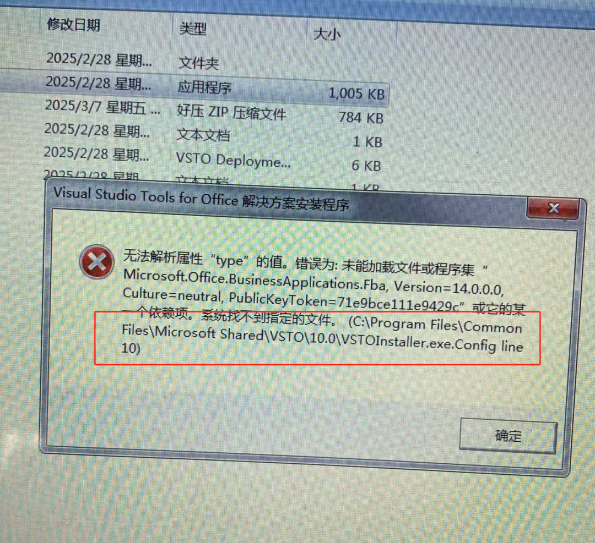

## 聊与AI插件安装包(Plugin installation package)

### 安装教程

```
# 进入Plugin installation package启动安装程序setup.exe
# 安装完成后打开word即可在上方导航栏看到聊与AI
```

**双击【setup.exe】。**


**点击【安装】**


 **有的用户安装的时候可能会遇到下面图片里的报错。（安装成功的可以跳过这一步）**



**（C:\Program Files\Common Files\Microsoft Shared\VSTO\10.0\VSTOInstaller.exe.Config）空格后面的line 10不是路径里的，不要复制到。**

**复制到文件路径这里，**


**再删除这个文件，**


**删除以后重新运行安装程序即可。**


**安装完成后，需要重新启动Word才能生效！**

### *使用教程*

```
进入word切换至聊与AI
点击KEY输入AIP_KEY（后台管理页面生成/联系我们购买key）
Url为本地部署后的服务器地址
（默认为http://127.0.0.1:3000/）
（可以在server.py文件修改地址）
扩选文本选择要使用的功能
```


**打开Word点击上方导航栏切换至聊与AI**


输入KEY（后台管理页面生成）和URL（部署到本地服务器的地址）


**点击【查询】，可以看到我们的KEY信息，包括还剩余多少tokens和使用天数。**


**点击【模型选择】，可以更换大模型，有“deepseek_r1”、“deepseek_r3”、“通义千问2.5_plus”、“文心一言4.0”这四种大模型，可以随意更换。**


**配置好之后，扩选文本内容，再点击相关功能即可在文档中生成内容**


**修改地址**


## 聊与AI后台管理服务端（server）

**如果以下需求，联系我们**

**1.跳过server端本地部署流程，使用远程服务器或者购买KEY**

### 安装教程

```
# 配置大模型API_KEY
打开config.json填入对应在各个大模型官网注册的API_KEY

conda create -n wai python=3.10
conda activate wai
# 切换到服务端目录
pip install -r requirements.txt
python server.py

# 访问
http://127.0.0.1:3001/
进入后台管理页面（可以在server.py文件修改地址）


```


运行成功


## 聊与AI后台管理前端(manager_web)

### 安装教程

```
# 技术栈：Vite+Vue3+elementui Plus
# 需要提前准备node环境，最低版本 v14.20
# 进入项目目录
cd 聊与AI后台管理服务端

# 安装依赖
npm install -registry=https://registry.npmmirror.com/
# 启动项目
npm run dev

# 构建生产环境
npm run build
```


## 联系我们

**聊与AI，**专注于研发、应用和推广人工智能技术，致力于通过智能化解决方案，提升各行各业的效率和服务质量。如医疗行业、农业、工业等等..相信在未来，随着人工智能技术的不断进步和应用领域的拓展，聊与AI会有不断的创新和突破，为更多的用户带来更加丰富和高效的AI体验

**合作咨询：**


邮箱：liaoyufurunqing@gmail.com
